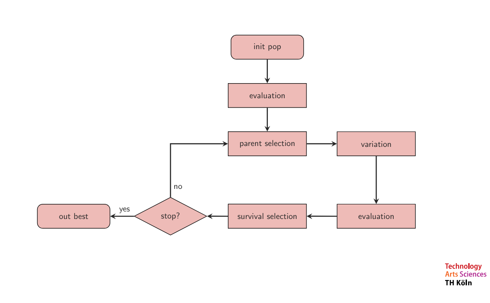

# TSP Solver using Evolutionary Algorithm

## Project Overview
This project implements an evolutionary algorithm to solve the Traveling Salesman Problem (TSP) using the `tsplib95` library and the `gr24` dataset. The goal is to find the shortest possible route that visits each city exactly once and returns to the origin city.

## Features
- Visualize graph of the problem
- Visualize distance matrix as a table
- Get a population of random permutations of a given path
- Get a paths weight
- Crossover (i.e. only position based crossover right now)
- Mutation with probability parameter
- Selections 
  - Parent Selectors(Tournament Selection, Above Average Selection)
  - Survival Selector

## Flowchart


## To Do
- init pop -> done
- evaluation / fitness -> done
- parent selection -> done
- variation / mutation + cross -> done
- survival selection -> done
- stop condition -> done
- return calculated best outcome -> done

## Installation
To run this project, you need to install the required Python libraries:

```bash
python -m pip install -U pip
pip install tsplib95
pip install matplotlib
pip install networkx
pip install pandas
pip install numpy
```
